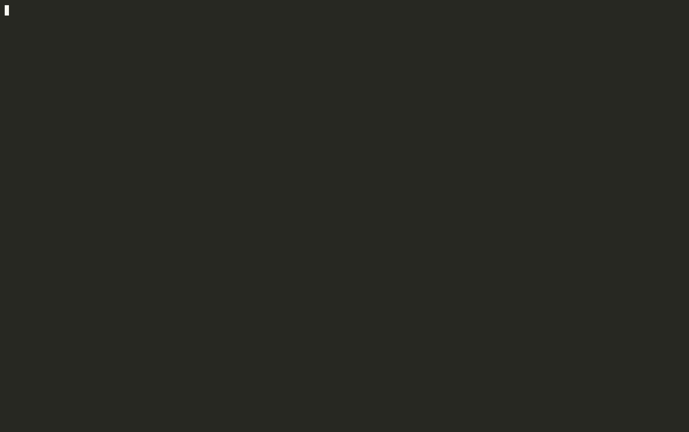

# agent-worktrunk

A lightweight setup for working across several repos and several workstreams at once
without leaving the terminal, built for driving agent CLIs like Claude Code. Each branch
gets its own git worktree and its own zellij tab, so agents can work in parallel without
touching each other's files, and reviewing, committing and reading docs happen in floating
panes over the same tab. It is a set of configs and small scripts over existing tools, not
a new app, with an installer so it can be rebuilt on any machine.



<sub>`wts feature/discounts` → `Alt m` (markdown, Mermaid drawn as text) → `Alt r` (review and comment) → `Alt g` (lazygit)</sub>

## What you get

- **Every terminal lands in one zellij session**, `main`. It is created on first use, attached
  if running, and resurrected if it died (reboot included). The first tab is `control`: one pane.
  Open a second terminal window and it joins the same session.
- **`wts <branch>`** opens a worktree in its own tab, named after the branch: a full-height
  pane on the left, two stacked panes on the right, all three shells inside the worktree.

  ```
  ┌──────────────┬──────────────┐
  │              │              │
  │              ├──────────────┤
  │              │              │
  └──────────────┴──────────────┘
  ```

  worktrunk does the git work: a new branch is created, an existing one is attached to. If
  the tab is already open, `wts` jumps to it. Tab completion is worktrunk's own, and anything
  `wt switch` accepts works (`wts -`, `wts ^`, `wts pr:12`, `wts --base main new-branch`);
  bare `wts` opens its picker. The pane you ran it from stays where it was.
- **`wts remove [branch...]`** runs `wt remove` and then closes the tabs those worktrees
  had. Flags pass through (`wts remove -f`, `-D`, `-y`); with no branch it removes the
  current worktree. `wts remove <TAB>` completes like `wt remove <TAB>`. A branch that is
  itself named `remove` has to be opened with `wt switch`.
- **`Alt g`** opens lazygit in a floating pane covering 95% of the screen, in the focused
  pane's directory. One per tab: pressing it again closes it, and so does Esc once no
  lazygit popup is open.
- **`Alt m`** reads the repo's markdown the same way: a floating pane with every `.md`
  file in fzf and a rendered preview. Enter opens one in a pager
  ([moor](https://github.com/walles/moor)), Esc or `q` goes back to the list, and Esc
  there (or `Alt m` anywhere) closes it. Mermaid blocks are drawn as text diagrams by
  [termaid](https://github.com/fasouto/termaid), and a diagram wider than the window
  scrolls sideways with the arrow keys; the rest is rendered by
  [glow](https://github.com/charmbracelet/glow). `wt-md <file>` does the same from a shell.
- **`Alt r`** reviews the branch in [tuicr](https://github.com/agavra/tuicr), like a
  GitHub pull request: its commits since it forked plus uncommitted work, with `c` to
  comment on a line, `v` for a range, `C` for the whole file. Comments are saved as you
  write them. `y` copies them all as markdown, `:submit` posts them to a PR, and `q`
  (or `Alt r`) closes it.
- **`Alt d`** opens [gh-dash](https://github.com/dlvhdr/gh-dash): your pull requests and
  the ones waiting on your review. `T` on a PR reviews it in tuicr, Esc closes it.
- **Review loop with Claude Code.** The installer adds tuicr's own skill to
  `~/.claude/skills/tuicr`. Ask Claude to let you review its changes (or run `/tuicr`)
  and it opens tuicr beside the chat; comment, quit with `q`, and Claude reads the
  comments straight from tuicr (`tuicr review comments`), fixes them, and can open the
  next round. It also picks up a review you started yourself with `Alt r`: tell it your
  comments are ready.
- **`review`** opens Zed with one multi-file diff of everything the branch changed since it
  forked from the default branch, committed or not. `review <ref>` compares against
  something else. The right-hand side is the live file, so edits land in the worktree.

## Tools

The installer adds any of these that are missing (see [Install](#install)).

| Tool | Used for |
| --- | --- |
| [zellij](https://zellij.dev) | The terminal multiplexer: the shared session, a tab per worktree, floating panes |
| [worktrunk](https://worktrunk.dev) | Creating, switching and removing git worktrees (`wt`), behind `wts` |
| [git](https://git-scm.com) | Everything underneath |
| [zsh](https://www.zsh.org) | The shell the workflow (`wts`, completion, auto-attach) is written for |
| [lazygit](https://github.com/jesseduffield/lazygit) | Git UI in the `Alt g` pane |
| [tuicr](https://github.com/agavra/tuicr) | PR-style diff review and line comments (`Alt r`), and the review loop with Claude Code |
| [GitHub CLI](https://cli.github.com) (`gh`) | GitHub access for tuicr and gh-dash, and `wts pr:<n>` |
| [gh-dash](https://github.com/dlvhdr/gh-dash) | Pull request dashboard in the `Alt d` pane |
| [fzf](https://github.com/junegunn/fzf) | The file picker in `Alt m` |
| [glow](https://github.com/charmbracelet/glow) | Rendering markdown in the terminal |
| [termaid](https://github.com/fasouto/termaid) | Drawing Mermaid diagrams as text |
| [moor](https://github.com/walles/moor) | The pager for rendered markdown |
| [jq](https://jqlang.github.io/jq/) | JSON handling in the scripts |
| [Zed](https://zed.dev) | The `review` command's multi-file diff, when you want a GUI |
| [Ghostty](https://ghostty.org) | The terminal on macOS (optional; any terminal works) |
| [Claude Code](https://claude.com/claude-code) | The agent CLI the review loop is built around (not installed for you) |

## Install

```sh
git clone https://github.com/a6wright/agent-worktrunk.git ~/workspace/agent-worktrunk
cd ~/workspace/agent-worktrunk
./install.sh --dry-run   # see what it would do
./install.sh
```

Then open a new terminal.

The installer is safe to re-run; a second run changes nothing. It:

1. Installs whichever of git, zsh, jq, zellij, worktrunk, lazygit, fzf, glow, moor,
   termaid, gh, tuicr and Zed are missing, plus the gh-dash extension once `gh` is logged
   in. macOS uses Homebrew (and adds Ghostty). Linux uses apt where it can, prebuilt
   binaries into `~/.local/bin` for zellij, worktrunk, glow, tuicr and moor (x86_64 only;
   elsewhere `wt-md` pages with less), uv or pipx for termaid, and Zed's
   own installer.
   `--no-tools` skips this step.
2. Links `config/zellij`, `config/tuicr` and `config/gh-dash` into `~/.config`. An existing
   config is moved to a timestamped backup first.
3. Links the scripts in `bin/` into `~/.local/bin`. A file already there that is not ours is
   left alone and reported.
4. Appends one marked block to `~/.zshrc` that sources the workflow. The block points at a
   stable link in `~/.config/agent-worktrunk`, not at this repo, so if you move the repo you
   only need to run `install.sh` again.
5. If Claude Code is set up (`~/.claude` exists), puts tuicr's skill in
   `~/.claude/skills/tuicr`, fetched from the tuicr release that is installed, and refreshes
   it when tuicr is upgraded. A skill of that name it did not put there is left alone.

Everything it does is recorded in `~/.local/state/agent-worktrunk/manifest`.

> The Linux installs of the newer tools (fzf, glow, moor, termaid, gh, tuicr) have only been
> checked piece by piece, not run end to end on a Linux machine; use `--dry-run` first there.
>
> On a Mac, the `Alt` keys need the terminal to send Option as Alt; otherwise Option-g
> types "©". The installer sets `macos-option-as-alt = true` in `~/.config/ghostty/config`
> (reload Ghostty's config with Cmd Shift , afterwards). For other terminals do it by
> hand: in Terminal.app enable "Use Option as Meta key" in the profile's Keyboard tab,
> in iTerm2 set the Option key to "Esc+" under Keys.

## Updating

```sh
cd ~/workspace/agent-worktrunk && git pull && ./install.sh
```

Configs and scripts are links into this clone, so `git pull` alone updates everything that
already exists. `./install.sh` catches what a pull cannot: new tools to install and new
scripts in `bin/` to link. It changes nothing when there is nothing new, so run both every
time.

Scripts pick up changes the next time they run and zellij reloads its config itself
(`zellij attach main` after a detach, if it does not). `workflow.zsh` loads when a shell
starts, so open a new terminal or run `exec zsh`.

## Uninstall

```sh
./uninstall.sh --dry-run
./uninstall.sh
```

Removes the `~/.zshrc` block, the links that point into this repo, the tuicr skill it put in
`~/.claude/skills`, and the `wt-review` cache, then restores anything the installer had backed up. `~/.zshrc` ends up byte-for-byte as it was.
Programs are left installed; `--tools` prints the commands to remove the ones the installer
added. zellij's saved sessions are left alone too.

## Knobs

Set these before the workflow block in `~/.zshrc`, or in the environment:

| Variable | Default | Effect |
| --- | --- | --- |
| `WORKFLOW_SESSION` | `main` | Name of the session terminals attach to |
| `WORKFLOW_NO_ZELLIJ` | unset | Set to anything to skip auto-attach for that shell |
| `WTS_LAYOUT` | `worktree` | Layout name (in `config/zellij/layouts`) or path used for new tabs |

Auto-attach is also skipped inside zellij, in shells without a real terminal, and in the
embedded terminals of Zed, VS Code, JetBrains and Emacs.

Two repos with the same branch name do not share a tab: the second one is named
`<repo>:<branch>`.

## Making it yours

Nothing here is tied to one person's machine. The parts most worth changing:

- `config/zellij/layouts/worktree.kdl`: pane arrangement, or start a command in a pane
  (`pane command="nvim"`).
- `config/tuicr/config.toml` and `config/gh-dash/config.yml`: tuicr and gh-dash settings,
  including gh-dash's PR sections and its `T` key.
- `config/lazygit/float.yml`: lazygit settings for the `Alt g` pane only, layered over
  your own lazygit config.
- `config/zellij/config.kdl`: the lazygit and markdown keys, themes, any other zellij option. Note that
  zellij's own settings UI writes to this file too, since `~/.config/zellij` links here.
- `shell/workflow.zsh`: session name, when auto-attach is skipped.

Edits take effect without re-running the installer, because everything is symlinked.

## License

[MIT](LICENSE). Do what you like with it.

## Layout

```
install.sh, uninstall.sh, lib.sh   installer, its reverse, shared helpers
config/zellij/config.kdl           overrides only; zellij merges it over its defaults
config/zellij/layouts/             control.kdl (session), worktree.kdl (per-branch tab)
shell/workflow.zsh                 auto-attach, wts and its completion, review alias
bin/wts-open-tab                   finds or creates the tab; called by wts via `wt switch -x`
bin/wts-tab-ids                    which tabs belong to which worktrees; used by wts remove
bin/wt-review                      builds the diff pairs and hands them to Zed
```
