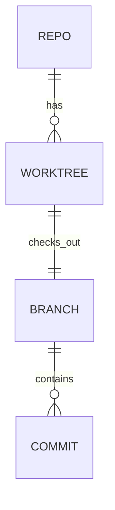

# Example schema

A tiny data model, to see how entity-relationship diagrams draw.

```mermaid
erDiagram
    REPO ||--o{ WORKTREE : has
    WORKTREE ||--|| BRANCH : checks_out
    BRANCH ||--o{ COMMIT : contains
```

Reading the markers: `||` is exactly one, `o{` is zero or more.
