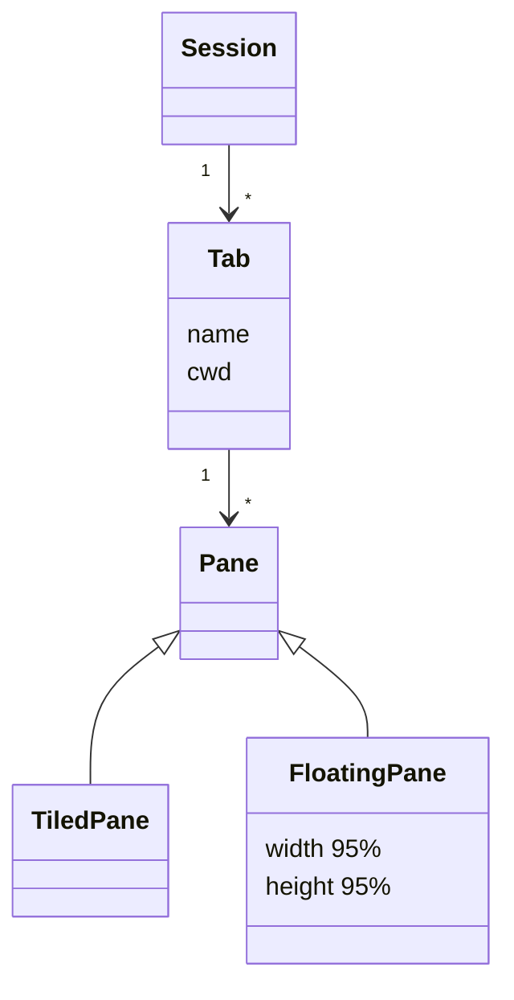
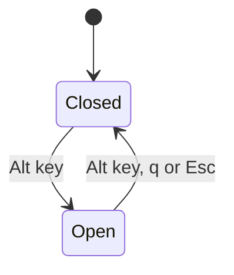

# Zellij pane model

A rough model of what a worktree tab holds.

```mermaid
classDiagram
    Session "1" --> "*" Tab
    Tab "1" --> "*" Pane
    Pane <|-- TiledPane
    Pane <|-- FloatingPane
    class Tab {
        name
        cwd
    }
    class FloatingPane {
        width 95%
        height 95%
    }
```

## Floating pane states

What `Alt g` and `Alt m` do to their pane.

```mermaid
stateDiagram-v2
    [*] --> Closed
    Closed --> Open: Alt key
    Open --> Closed: Alt key, q or Esc
```
