# Release pipeline

A deliberately long left-to-right diagram, wider than most screens. Open it with Enter
and scroll sideways with the right and left arrow keys; a `<` or `>` at the edge says
there is more that way. The preview on the list only shows the left end.

```mermaid
graph LR
    A[Branch created] --> B[First commit] --> C[Push] --> D[Lint] --> E[Unit tests]
    E --> F[Build image] --> G[Integration tests] --> H[Security scan]
    H --> I[Code review] --> J[Merge to main] --> K[Tag release]
    K --> L[Deploy staging] --> M[Smoke tests] --> N[Deploy production] --> O[Announce]
```

Everything after the diagram wraps to the window as usual, so only the diagram needs
sideways scrolling.
