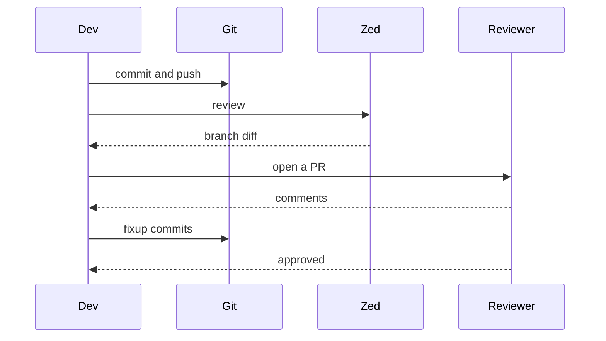

# Review handoff

Who talks to whom when a branch goes up for review.

## Notes

- `->>` is a solid arrow (a request), `-->>` a dashed one (a reply).
- Try adding `Note over Dev,Git: CI runs here` between two lines.
