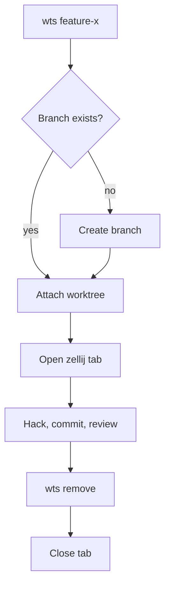
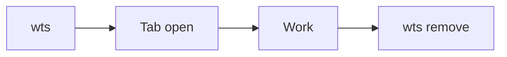

# Worktree lifecycle

What happens from `wts <branch>` to `wts remove`.

The same thing left to right, which suits wide screens:

## Try

- Add a `B -->|yes, and open| E` edge and see how the routing changes.
- Change `graph TD` to `graph LR`.
