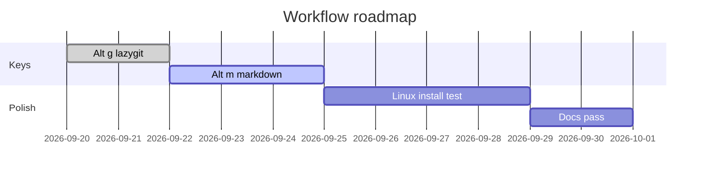
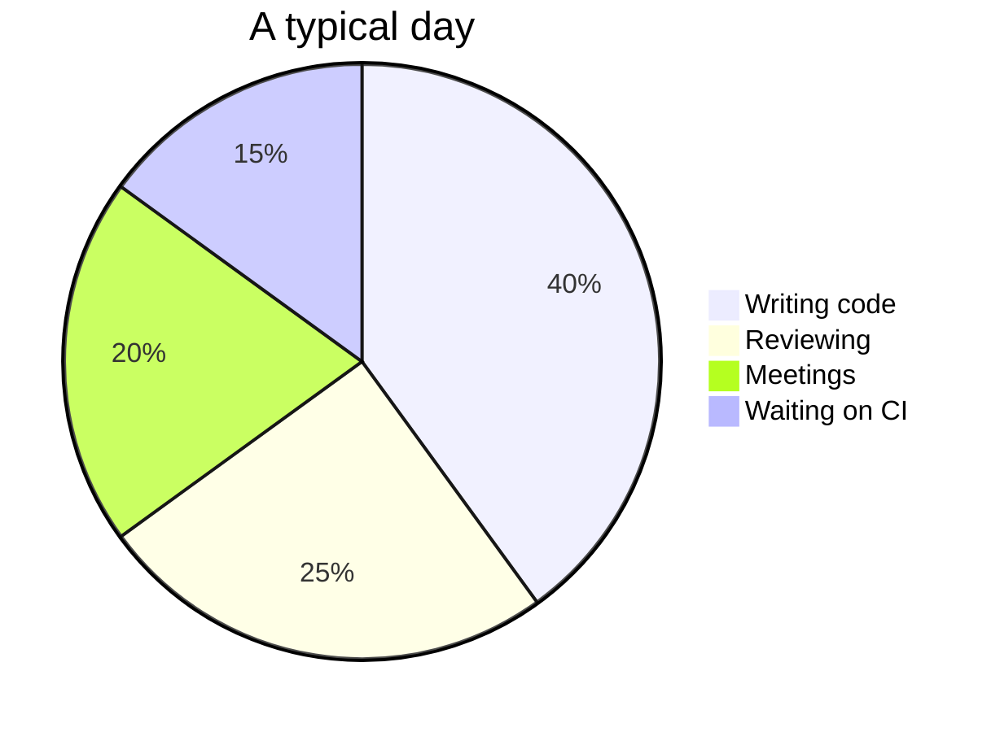

# Roadmap

```mermaid
gantt
    title Workflow roadmap
    dateFormat YYYY-MM-DD
    section Keys
    Alt g lazygit      :done, a1, 2026-09-20, 2d
    Alt m markdown     :active, a2, 2026-09-22, 3d
    section Polish
    Linux install test :a3, after a2, 4d
    Docs pass          :a4, after a3, 2d
```

## Where the time goes

```mermaid
pie title A typical day
    "Writing code" : 40
    "Reviewing" : 25
    "Meetings" : 20
    "Waiting on CI" : 15
```
